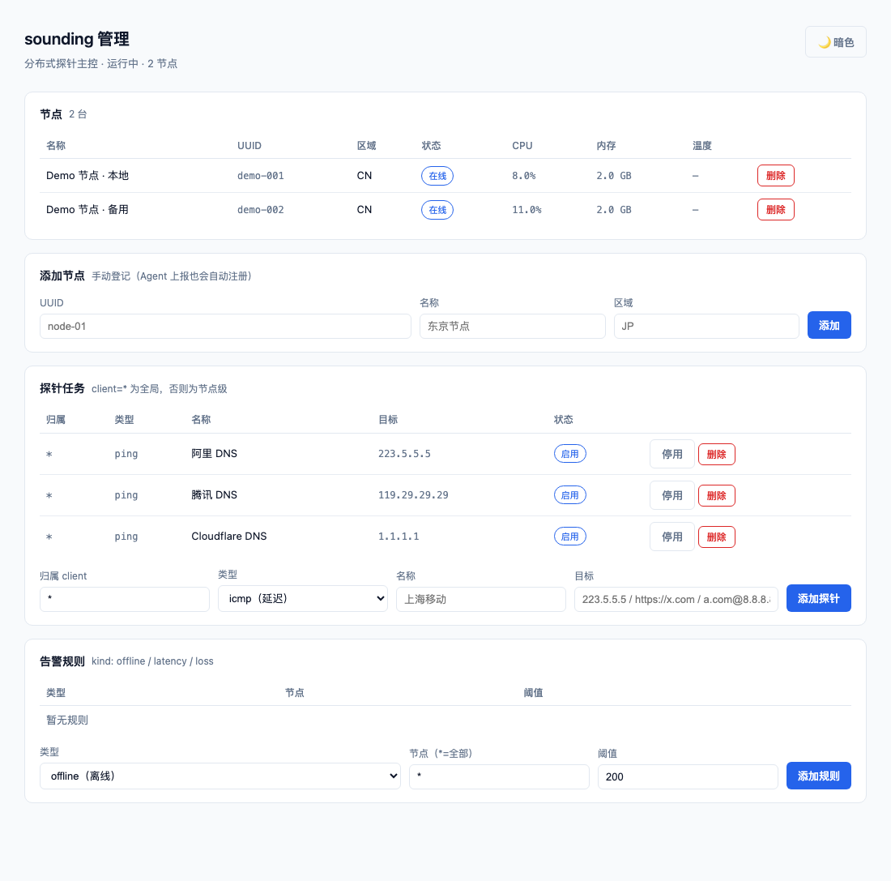
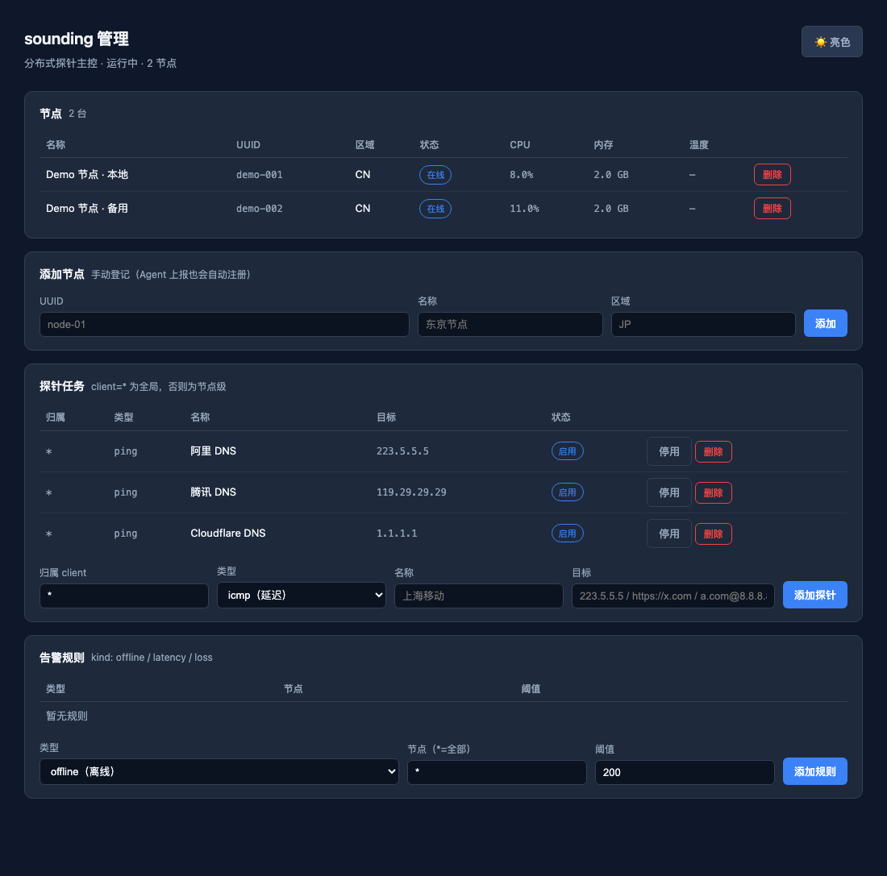

<div align="center">

# sounding

**兼容 Komari RPC 契约的自主分布式探针（Go）**

主控 + Agent 自托管实现——前端直接复用 [komari-theme-ink](https://github.com/jacob-bytes/komari-theme-ink) 主题。

[](LICENSE)
[](https://go.dev)
[](https://github.com/jacob-bytes/sounding/pulls)

</div>

---

## 在线演示

> 部署自己的演示站（任选其一，均**免费无需信用卡**）：
> ```bash
> ./scripts/deploy-demo.sh vps     # 自有 VPS + Cloudflare Tunnel（推荐）
> ./scripts/deploy-demo.sh hf      # Hugging Face Spaces（无休眠）
> ./scripts/deploy-demo.sh koyeb   # Koyeb 免费实例
> ./scripts/deploy-demo.sh local   # 本地 + 临时公网
> ```

## 截图

**内置管理页**（`/admin/`——节点 / 探针 / 告警规则，**亮/暗自选，默认亮色**）

| 亮色（默认） | 暗色 |
|---|---|
|  |  |

## 架构

```text
┌─────────────┐  HTTPS + token   ┌──────────────────┐  JSON-RPC 2.0  ┌──────────────┐
│ sounding-   │ ───────────────▶ │  sounding-server │ ──────────────▶ │              │
│ agent       │  上报/心跳        │  (主控/存储/API)  │  POST /rpc2    │ ink 前端     │
│ 节点采集     │ ◀─────────────── │  SQLite          │ ◀────────────── │ 仪表盘       │
└─────────────┘   配置/任务       └──────────────────┘                └──────────────┘
```

- **sounding-server**：接收 Agent 上报 + 历史存储 + 暴露 Komari 兼容 RPC（ink 零改动接入）
- **sounding-agent**：节点端采集（CPU/内存/磁盘/网络/系统/uptime）定时上报
- **探针调度器**：**ICMP 真探测**（非特权优先，失败回退 TCP）——结果经 `getPingRecords` 暴露
- **告警**：离线/延迟/丢包规则（运行时 CRUD）+ **Telegram / Webhook** 通知（Notifier 接口可扩展）
- **认证**：JWT 登录（HS256）+ Admin Token 双轨
- **管理界面**：内置 `/admin/`（Go embed 单文件页——节点/探针/告警可视化）+ 可选挂载 ink 监控面板
- **契约**：`contracts/contracts.md`（字段级——以 ink 为金标准）

## 能力清单

| 能力 | 说明 |
|---|---|
| 节点采集 | CPU / 内存 / Swap / 磁盘 / 网络 / 负载（1/5/15）/ 温度 / 系统信息 |
| 探针 | **ICMP / TCP / HTTP / DNS** 四类型 · per-node 目标 · 全局任务 |
| 实时 | **WebSocket JSON-RPC**（ink 秒级刷新）+ HTTP 轮询 |
| 告警 | 离线 / 延迟 / 丢包 → **Telegram + Webhook**（运行时 CRUD，5min 去重） |
| 认证 | JWT 登录（HS256）+ Admin Token |
| 存储 | SQLite（WAL）· 自动保留清理 + VACUUM |
| 管理 | 内置 `/admin/` 页面 + 完整 REST API + Agent 远程配置下发 |
| 部署 | 单二进制 / Docker / 一键脚本 / 4 平台 Release |

## 快速开始

```bash
go build -o sounding-server ./cmd/server
./sounding-server -addr :8080 -db sounding.db   # 自动迁移 + 演示种子
```

打开管理页：**http://localhost:8080/admin/**（添加节点 / 配置探针 / 告警规则）

验证端点（JSON-RPC 2.0——ink 同款）：

```bash
curl -X POST http://localhost:8080/rpc2 -H 'Content-Type: application/json' \
  -d '{"jsonrpc":"2.0","id":1,"method":"getNodes","params":{}}'
# → result: {"demo-001": {"uuid":"demo-001","name":"Demo 节点 · 本地",...}}
```

### Agent（M2）

```bash
go build -o sounding-agent ./cmd/agent
./sounding-agent -server http://localhost:8080 -token sounding-demo-token -interval 15s
# 首次上报自动注册节点；上报即心跳（离线 = 超时无上报）
```

接入 ink 前端（`.env` 设置 `VITE_API_BASE=http://localhost:8080`）——首页/详情即跑通：

```bash
# 完整运行（主控 + 探针 + 管理后台）
./sounding-server -addr :8080 -db sounding.db -static ./ink-dist
# → http://localhost:8080 即 ink 管理后台（图表/探针/节点全可看）
```

## 路线图

| 里程碑 | 内容 | 状态 |
|---|---|---|
| M1 | 主控 3 端点（nodes/latest/recent）+ SQLite + 演示数据 | ✅ |
| M2 | Agent 采集器（gopsutil + 上报 + 心跳） | ✅ |
| M3 | 探针调度器 + getPingRecords + ink 面板挂载 | ✅ |
| M4 | 管理 API + per-node 探针 + Admin Token | ✅ |
| M5 | Docker 编排 + 跨平台 Release（linux/darwin × amd64/arm64） | ✅ |
| M6 | ink 契约对齐（map 格式）+ 节点卡片满血渲染 | ✅ |
| M7 | ICMP 真探测 + 离线判定 + 告警 Webhook + JWT 认证 | ✅ |
| M8 | 历史保留 + 温度/负载指标 + 健康检查 + 一键安装 | ✅ |
| M9 | **WS 实时通道 + Telegram 通知 + 告警 CRUD + 内置管理页 + Agent 远程配置** | ✅ |
| M10 | 通知渠道扩展（钉钉/飞书/邮件）、PostgreSQL 存储、探针类型扩展 | ⏳ |

## 目录

```text
cmd/server         主控入口
cmd/agent          Agent 入口（含 -config 热重载 / -remote-config 远程拉取）
internal/api       JSON-RPC 2.0 + WS 处理器（契约实现）+ 管理 API
internal/store     SQLite 存储（nodes/status_history/probe_*）+ 保留策略
internal/collect   Agent 采集（gopsutil：CPU/内存/磁盘/网络/温度/负载）
internal/probe     探针（ICMP/TCP）+ 调度器
internal/alert     告警规则 + 去重 + 多渠道投递
internal/notify    通知渠道（Notifier 接口：Telegram / Webhook）
internal/auth      JWT 签发/校验
internal/adminui   内置管理页（Go embed）
contracts/         RPC 契约清单（字段级）
scripts/           一键安装脚本
```


## 主控部署（sounding-server）

### 方式一：一键脚本（推荐——含 ink 监控面板）

```bash
curl -fsSL https://raw.githubusercontent.com/jacob-bytes/sounding/main/scripts/install.sh | sh -s -- server
```

脚本会自动完成：
1. 下载 `sounding-server`（按 OS/架构）
2. **下载 ink 监控面板** → `/var/lib/sounding/admin`（sounding 自动挂载）
3. 打印启动命令（管理页 + 面板地址）

### 方式二：Docker

```bash
docker run -d --name sounding \
  -p 8080:8080 \
  -v sounding-data:/data \
  -e SOUNDING_AGENT_TOKEN=changeme-agent \
  -e SOUNDING_ADMIN_TOKEN=changeme-admin \
  ghcr.io/jacob-bytes/sounding:latest

# 带 ink 监控面板（挂载前端构建产物）
docker run -d -p 8080:8080 -v sounding-data:/data -v ./ink-dist:/admin \
  ghcr.io/jacob-bytes/sounding:latest -static /admin
```

### 方式三：二进制 / 源码

```bash
# 下载对应平台二进制（Releases 页）或本地编译
go build -o sounding-server ./cmd/server

./sounding-server \
  -addr :8080 \
  -db /var/lib/sounding/sounding.db \
  -agent-token <agent-token> \
  -admin-token <admin-token> \
  -admin-user admin -admin-pass <password> \
  -retain-days 30
```

### 部署后

| 入口 | 地址 |
|---|---|
| **管理页** | `http://<主机>:8080/admin/`（首次访问输入 Admin Token） |
| **ink 监控面板** | `http://<主机>:8080/`（一键脚本自动安装；或 `-static <ink-dist>`） |
| 健康检查 | `http://<主机>:8080/healthz` |
| Agent 接入 | 各节点执行 `sounding-agent -server http://<主机>:8080 -token <agent-token>` |

### systemd 示例

```ini
[Unit]
Description=sounding server
After=network.target

[Service]
ExecStart=/usr/local/bin/sounding-server -addr :8080 -db /var/lib/sounding/sounding.db \
  -agent-token <agent-token> -admin-token <admin-token> -retain-days 30
Restart=always
User=sounding

[Install]
WantedBy=multi-user.target
```

## 配置手册

### 添加服务器（两种方式）

**① 一键自动**：Agent 启动即自动注册（推荐）：

```bash
./sounding-agent -server http://主控:8080 -token <agent-token> -node-uuid n1
```

**② 手动 API**：

```bash
curl -X POST http://主控:8080/api/admin/nodes -H 'X-Admin-Token: <admin-token>' \
  -H 'Content-Type: application/json' \
  -d '{"uuid":"manual-01","name":"东京节点","region":"JP","cpu_cores":4,"mem_total":8589934592}'
```

### 不同服务器不同延迟目标（per-node）

```bash
# Agent 启动参数声明本节点测试目标（"名称:主机" 逗号分隔）
./sounding-agent -server http://主控:8080 -node-uuid n1 \
  -probe "上海移动:223.5.5.5,腾讯 DNS:119.29.29.29"
```
→ 主控自动创建 `client=n1` 的探针任务（与全局任务共存，结果经 getPingRecords 返回）

**管理 API 一览**：

| 端点 | 方法 | 用途 |
|---|---|---|
| `/api/admin/nodes` | GET / POST | 查看 / 手动添加服务器 |
| `/api/admin/probes` | GET / POST / DELETE | 查看 / 配置 / 删除探针任务（`client=*` 全局 / `client=n1` 节点级） |
| `/api/admin/alerts` | GET / POST / DELETE | 告警规则运行时 CRUD（kind/node/threshold） |
| `/agent/config` | GET | Agent 拉取远程配置（探针目标下发） |
| `/admin/` | GET | **内置管理页**（节点/探针/告警可视化） |
| `/agent/status` | POST | Agent 上报（`X-Auth-Token`） |

> 认证：管理 API 用 `-admin-token`；Agent 上报用 `-agent-token`。


## 配置方式（CLI / 环境变量 / 配置文件）

纯 CLI 不够灵活？支持**配置文件 + 热重载**（改配置无需重启）：

```yaml
# agent.yml（-config 指定；SIGHUP 或编辑保存即热重载）
server: http://localhost:8080
token: sounding-demo-token
node_uuid: n1
interval: 15s
probes:
  - "上海移动:223.5.5.5"
  - "腾讯 DNS:119.29.29.29"
```

```bash
./sounding-agent -config ./agent.yml          # 文件配置（推荐）
kill -HUP <pid>                                # 手动热重载
# 或直接编辑保存 agent.yml（30s 内自动感知）
```

**优先级**：`CLI flag > 环境变量 > 配置文件 > 默认值`（server/token/probes 每次上报都读最新值——**修改即刻生效**）。


## 部署模型（开源使用说明）

**每个使用者自托管自己的主控**——Agent 只需指向自己的主控地址：

```bash
# 使用者 A（推荐容器/环境变量方式）
SOUNDING_SERVER=https://a.example.com \
SOUNDING_TOKEN=<a-token> \
SOUNDING_PROBES="上海移动:223.5.5.5,腾讯 DNS:119.29.29.29" \
  ./sounding-agent -node-uuid a-n1

# 使用者 B（CLI 方式指自己的主控）
./sounding-agent -server http://b.example.com:8080 -token <b-token> -node-uuid b-n1
```

**配置优先级**：`CLI flag > 环境变量 > 默认值`

| 环境变量 | 对应 flag | 说明 |
|---|---|---|
| `SOUNDING_SERVER` | `-server` | 主控地址（**必配——指到自己的主控**） |
| `SOUNDING_TOKEN` | `-token` | 上报 token |
| `SOUNDING_NODE_UUID` | `-node-uuid` | 节点 ID（默认主机名） |
| `SOUNDING_PROBES` | `-probe` | 本节点延迟目标 |
| `SOUNDING_INTERVAL` | `-interval` | 采集周期 |

> 主控侧：`-agent-token` 与 `-admin-token` 由部署者自行设定——**不同部署者互不干扰**（各自的 server 管各自的 agents）。

## Docker / Release

```bash
docker compose up -d   # 主控（挂载 ./admin 为 ink 管理后台）
# 发布：打 tag vX.Y.Z → Actions 自动构建 4 平台二进制 → Release
```

## 前端（ink 监控面板）

sounding 的展示前端复用 [komari-theme-ink](https://github.com/jacob-bytes/komari-theme-ink)：

| 获取方式 | 命令 |
|---|---|
| **一键脚本**（推荐） | `install.sh server` 自动下载到 `/var/lib/sounding/admin` |
| 手动下载 Release | 解压 `ink-build-*.zip` → `dist/` 放到 `./admin` 或 `-static` 指定 |
| 源码构建 | `cd komari-theme-ink && bun run build` → `-static ./dist` |

**零配置**：ink 默认 API base 为 `/api`，sounding 已提供同源 `/api/rpc2` 别名——**无需改 ink**。

## 与 ink 前端联调

```bash
# 构建 ink（指向 sounding）
cd komari-theme-ink && VITE_API_BASE=http://localhost:8080 bun run build
# 主控挂载管理后台
./sounding-server -addr :8080 -db sounding.db -static ./komari-theme-ink/dist
# → http://localhost:8080 即完整面板（初始化/设置/健康检查/数据新鲜度全通）
```

## 运维与安全

| 能力 | 用法 |
|---|---|
| **ICMP 真探测** | 默认启用（非特权 ICMP，失败自动回退 TCP） |
| **离线判定** | 60s 无上报标记离线（前端卡片灰显） |
| **告警通知** | **Telegram**：`-telegram-token <bot> -telegram-chat-id <id>`；**Webhook**：`-alert-webhook <url>`（可同时启用，5 分钟去重） |
| **JWT 登录** | `-admin-user admin -admin-pass <pw> -jwt-secret <secret>` → `POST /api/login` |
| **历史保留** | `-retain-days 30`（6 小时清理 + VACUUM） |
| **健康检查** | `GET /healthz`（LB/K8s 探针） |
| **实时通道** | `/public` 返回 `theme_settings.rpcTransportMode=websocket` → ink 自动走 WS（秒级推送） |
| **一键安装** | `curl -fsSL .../scripts/install.sh \| sh -s -- server`（自动识别 OS/架构 + 拉最新 Release） |
| **内置管理页** | `http://<主控>:8080/admin/`（Go embed 单文件——节点/探针/告警规则可视化配置） |
| **Agent 远程配置** | 主控改探针 → Agent 30s 内自动拉取（`-remote-config`，默认开） |

### 集群化（P2-3）

主控为**无状态服务**（唯一状态在 SQLite）——水平扩展方案：
1. **单写多读**：主控实例共享同一 SQLite（NFS/云盘）+ 外部 LB（`/healthz` 健康检查）
2. **换存储**：将 `internal/store` 适配到 PostgreSQL（接口已隔离，替换实现即可）
3. Agent 侧无状态——指向 LB 地址即可（任一主控可处理上报）

## 通知渠道扩展（Notifier 接口）

新增渠道只需实现 `internal/notify.Notifier`（`Name()` + `Send(ctx, Message)`）——当前已内置：

| 渠道 | 参数 |
|---|---|
| **Telegram** | `-telegram-token` + `-telegram-chat-id` |
| **钉钉** | `-dingtalk-webhook <url>`（可选 `-dingtalk-secret` 加签） |
| **飞书** | `-feishu-webhook <url>` |
| **邮件** | `-smtp-host -smtp-user -smtp-pass -smtp-from -smtp-to` |
| Webhook | `-alert-webhook <url>`（JSON POST） |

新增渠道：实现 `internal/notify.Notifier`（`Name()` + `Send()`）→ 在 main 注册即可。

## 致谢

- 前端契约金标准：[komari-theme-ink](https://github.com/jacob-bytes/komari-theme-ink)
- 上游平台：[Komari Monitor](https://github.com/elevenhq/komari-monitor)

MIT License——欢迎 Star / Issue / PR 共建。
