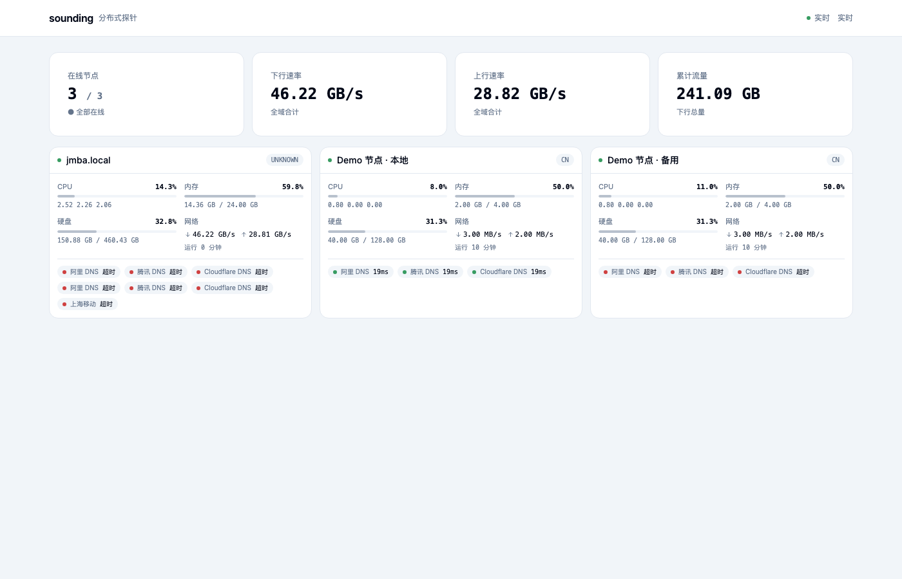
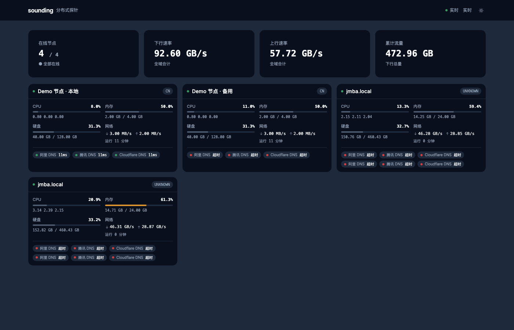

# sounding

**兼容 Komari RPC 契约的自主分布式探针（Go）**

主控 + Agent 自托管，可直接挂载 [komari-theme-ink](https://github.com/jacob-bytes/komari-theme-ink) 主题。

---

## 特性

| 能力 | 说明 |
|---|---|
| 节点采集 | CPU / 内存 / Swap / 磁盘 / 网络 / 负载（1/5/15）/ 温度 / 系统信息 / uptime |
| 探针 | **ICMP / TCP / HTTP / DNS** · 全局 + per-node 目标 · 按任务间隔调度 |
| 实时 | WebSocket JSON-RPC + HTTP 轮询 |
| 告警 | 离线 / 延迟 / 丢包 → Telegram / 钉钉 / 飞书 / 邮件 / Webhook（规则持久化，5min 去重，支持静默时段） |
| 认证 | JWT（HS256）+ Admin Token 双轨；空 token/密钥自动随机生成并持久化 |
| 存储 | SQLite（WAL）· 自动保留清理 + VACUUM |
| 管理 | 内置 `/admin/` 页面 + REST API + Agent 远程配置下发 |
| **ink 兼容** | 实现 ink 全量 RPC 契约，**真实 ink 主题零改动接入**（首页/详情/图表已实测） |
| 部署 | 单二进制 / Docker / 一键脚本（deploy·agent·docker·status·uninstall）/ 4 平台 Release |

## 截图

| 监控面板（亮） | 监控面板（暗） |
|---|---|
|  |  |

节点详情与内置管理页见 [docs/](docs/)（`detail.png`、`admin-light.png`、`admin-dark.png`）。

## 快速开始

### 一键部署（推荐）

```bash
# 主控：二进制 + ink 面板 + systemd + 自动生成 token + 健康检查
curl -fsSL https://raw.githubusercontent.com/jacob-bytes/sounding/main/scripts/install.sh | sh -s -- deploy

# 节点 Agent：一条命令接入
curl -fsSL https://raw.githubusercontent.com/jacob-bytes/sounding/main/scripts/install.sh | \
  SOUNDING_AGENT_SERVER=http://<主控>:8080 SOUNDING_AGENT_TOKEN=<agent-token> sh -s -- agent

# 其它：docker / status / update / uninstall / help
```

部署后：

| 入口 | 地址 |
|---|---|
| 管理页 | `http://<主机>:8080/admin/` |
| ink 监控面板 | `http://<主机>:8080/` |
| 健康检查 | `http://<主机>:8080/healthz` |

### 本地开发

```bash
go build -o sounding-server ./cmd/server
./sounding-server -addr :8080 -db sounding.db -seed \
  -agent-token sounding-demo-token -admin-token sounding-demo-admin

go build -o sounding-agent ./cmd/agent
./sounding-agent -server http://localhost:8080 -token sounding-demo-token -interval 15s
```

## 架构

```text
┌─────────────┐  HTTPS + token   ┌──────────────────┐  JSON-RPC 2.0 / WS  ┌──────────────┐
│ sounding-   │ ───────────────▶ │  sounding-server │ ──────────────────▶ │ ink / 自研   │
│ agent       │  上报/心跳        │  SQLite + 探针    │ ◀────────────────── │ 前端面板     │
│ 节点采集     │ ◀─────────────── │  调度 + 告警      │   实时推送/查询      └──────────────┘
└─────────────┘   配置/任务       └──────────────────┘
```

- **sounding-server**：接收上报 + 历史存储 + ink 兼容 RPC + 探针调度 + 告警
- **sounding-agent**：节点采集上报（上报即心跳，60s 无上报判定离线）
- **认证**：Agent 用 `-agent-token`，管理 API 用 `-admin-token` 或 JWT

## 前端

| 方案 | 说明 |
|---|---|
| **① ink 主题（推荐）** | 挂载 ink `dist/`，功能完整、零改动；`install.sh deploy` 自动安装到 `/var/lib/sounding/admin` |
| **② 自研轻量面板** | `web/dashboard/`（Vue 3 + Vite + Tailwind），适合内网/单二进制兜底 |

```bash
# 挂载 ink（同源构建务必 VITE_API_BASE=/api）
cd komari-theme-ink && VITE_API_BASE=/api bun run build
./sounding-server -addr :8080 -db sounding.db -static ./komari-theme-ink/dist

# 自研面板
cd web/dashboard && bun install && bun run build
./sounding-server -static web/dashboard/dist
```

- 差异分析与复刻路线：[docs/ink-parity.md](docs/ink-parity.md)
- 自研面板移植步骤：[docs/frontend-porting-plan.md](docs/frontend-porting-plan.md)

## 文档

| 文档 | 内容 |
|---|---|
| [docs/deployment.md](docs/deployment.md) | 一键部署 / Docker / systemd / 更新卸载 / 集群化 |
| [docs/configuration.md](docs/configuration.md) | 添加节点 / 探针 / 管理 API / Agent 配置 / 告警 / 参数 |
| [docs/ink-parity.md](docs/ink-parity.md) | 自研面板 vs ink 差异分析 |
| [docs/frontend-porting-plan.md](docs/frontend-porting-plan.md) | 自研面板移植 ink 的分阶段步骤 |
| [contracts/contracts.md](contracts/contracts.md) | RPC 字段级契约 |

## 运维与安全

| 能力 | 用法 |
|---|---|
| ICMP 真探测 | 默认启用（非特权优先，失败回退 TCP） |
| 离线判定 | 60s 无上报 |
| 告警通知 | `-alert-webhook` / `-telegram-token` / `-dingtalk-webhook` / `-feishu-webhook` / SMTP |
| JWT 登录 | `-admin-user admin -admin-pass <pw>` → `POST /api/login` |
| 历史保留 | `-retain-days 30`（6 小时清理 + VACUUM） |
| 健康检查 | `GET /healthz` |
| 安全默认 | token/密钥为空自动随机生成并持久化（重启不变），不再有固定弱口令 |

## 路线图

| 里程碑 | 状态 |
|---|---|
| M1–M9 主控 / Agent / 探针 / 告警 / 管理页 / 实时通道 | ✅ |
| ink 全量 RPC 契约 + 真实 ink 零改动接入 | ✅ |
| 自研面板 P0 视觉对齐（见移植计划） | ⏳ |
| 通知渠道扩展 / PostgreSQL / GPU / 审计 / 访客统计 | ⏳ |

## 许可

MIT License。前端契约金标准：[komari-theme-ink](https://github.com/jacob-bytes/komari-theme-ink)；上游平台：[Komari Monitor](https://github.com/elevenhq/komari-monitor)。
